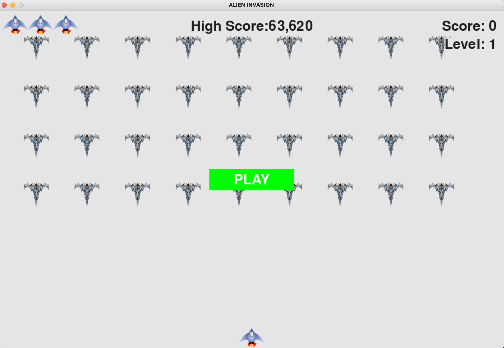

# Alien Invasion
This is an arcade-style game based on a project from "Python Crash Course" 1st edition by Eric Matthes
 
# Required Tech

Python 3 + PyGame

#Running the Game

Run "run_game".py

This screen should appear:



#Playing the game

Shoot down all the alien ships before the reach the bottom! You have three lives (see top-left corner of the screen). Every new level the game speeds up!

#Adjusting the settings

Go to settings.py

```
class Settings():
	def __init__(self):#Initialize the game settings

		#Screen settings
		self.screen_width = 1200
		self.screen_height = 800
		self.bg_color = (230,230,230)

		#ship settings
		self.ship_limit = 3

		#bullet settings
		self.bullet_width = 7 #7
		self.bullet_height = 15
		self.bullet_color = 150, 0, 0
		self.bullets_allowed = 3

		#alien settings
		self.alien_vertical_speed = 15				
		#How quickly the game speeds up
		self.speedup_scale = 1.1 #1.1
		self.score_scale = 1.5

		self.initialize_dynamic_settings()

	def initialize_dynamic_settings(self):
		self.ship_speed_factor = 1.5 #1.5
		self.bullet_speed_factor = 5 #5
		self.alien_horizontal_speed = 1 #1 
		self.fleet_direction = 1 #or -1, switch when the aliens hit an edge
		self.alien_points = 50

	def increase_speeds(self):
		self.ship_speed_factor *= self.speedup_scale
		self.bullet_speed_factor *= self.speedup_scale
		self.alien_horizontal_speed *= self.speedup_scale
		self.alien_points *= self.score_scale
		self.alien_points = int(self.alien_points)
```
You can change things to customize the game experience!

For example, to make the game harder, try raising the self.speedup_scale (defaults are in the comments, such as #1)

# Questions?

Contact me at efim@shulginmusic.com
 
 
